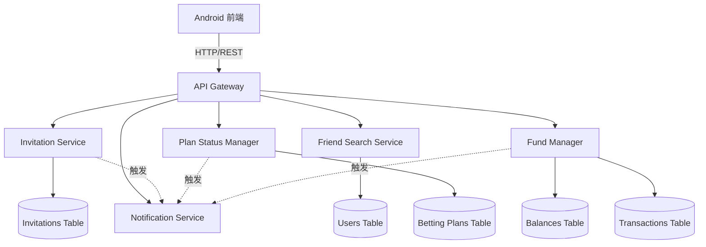
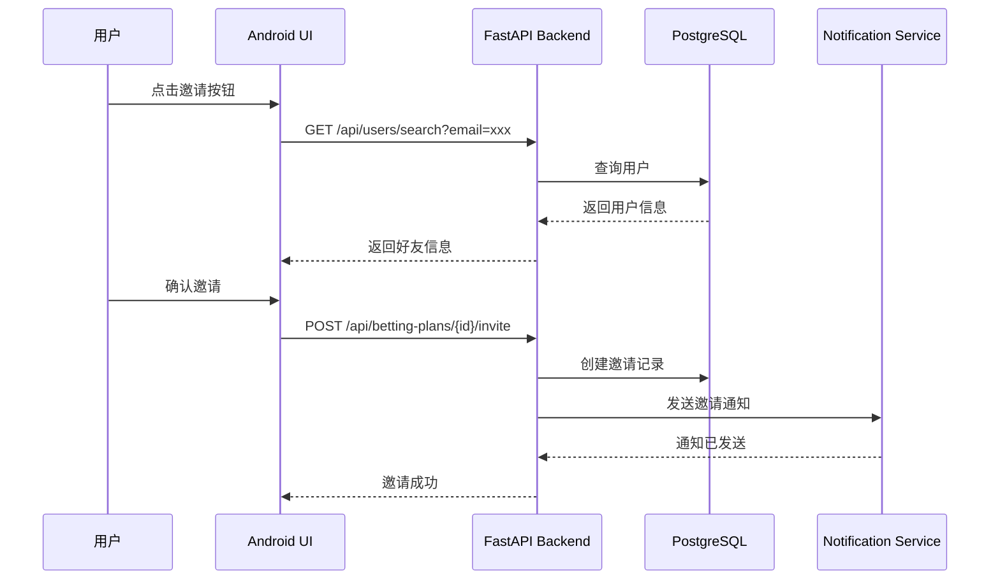

# 设计文档: 邀请好友和放弃计划功能

## 概述

本设计文档定义了减肥对赌应用中的好友邀请和计划放弃功能的技术实现方案。该功能允许用户通过邮箱搜索并邀请好友参与减肥计划，同时支持在不同状态下放弃计划，并正确处理赌金的冻结、解冻和转账逻辑。系统采用 Python FastAPI 后端和 Kotlin Android 前端架构，确保资金操作的原子性和数据一致性。

## 架构

系统采用分层架构，包含数据层、服务层、API 层和前端展示层：



### 核心组件交互流程



## 组件和接口

### 组件 1: Invitation Service (邀请服务)

**目的**: 管理好友邀请的创建、查询和响应

**接口**:
```python
class InvitationService:
    @staticmethod
    def create_invitation(
        db: Session,
        plan_id: str,
        inviter_id: str,
        invitee_email: str
    ) -> Invitation
    
    @staticmethod
    def get_invitation_by_plan(
        db: Session,
        plan_id: str
    ) -> Optional[Invitation]
    
    @staticmethod
    def get_user_invitations(
        db: Session,
        user_id: str,
        status: Optional[InvitationStatus] = None
    ) -> List[Invitation]
    
    @staticmethod
    def update_invitation_status(
        db: Session,
        invitation_id: str,
        status: InvitationStatus,
        response_time: datetime
    ) -> Invitation
```

**职责**:
- 创建和存储邀请记录
- 跟踪邀请状态（pending, viewed, accepted, rejected）
- 记录邀请时间戳（发送、查看、响应）
- 防止重复邀请

### 组件 2: Friend Search Service (好友搜索服务)

**目的**: 通过邮箱搜索用户信息

**接口**:
```python
class FriendSearchService:
    @staticmethod
    def search_by_email(
        db: Session,
        email: str
    ) -> Optional[UserSearchResult]
    
    @staticmethod
    def validate_email_format(email: str) -> bool
```

**职责**:
- 验证邮箱格式
- 查询用户数据库
- 返回用户基本信息（姓名、年龄）
- 保护用户隐私（不返回敏感信息）

### 组件 3: Plan Status Manager (计划状态管理器)

**目的**: 管理计划状态转换和过期检查

**接口**:
```python
class PlanStatusManager:
    @staticmethod
    def transition_status(
        db: Session,
        plan_id: str,
        from_status: PlanStatus,
        to_status: PlanStatus,
        user_id: str
    ) -> BettingPlan
    
    @staticmethod
    def check_expired_plans(db: Session) -> List[BettingPlan]
    
    @staticmethod
    def mark_as_expired(
        db: Session,
        plan_id: str
    ) -> BettingPlan
    
    @staticmethod
    def abandon_plan(
        db: Session,
        plan_id: str,
        user_id: str
    ) -> AbandonResult
```

**职责**:
- 验证状态转换的合法性
- 执行状态转换逻辑
- 定期检查过期计划
- 处理计划放弃操作

### 组件 4: Fund Manager (资金管理器)

**目的**: 处理资金冻结、解冻和转账操作

**接口**:
```python
class FundManager:
    @staticmethod
    def freeze_funds(
        db: Session,
        user_id: str,
        plan_id: str,
        amount: float
    ) -> FreezeResult
    
    @staticmethod
    def unfreeze_funds(
        db: Session,
        user_id: str,
        plan_id: str
    ) -> UnfreezeResult
    
    @staticmethod
    def transfer_funds(
        db: Session,
        from_user_id: str,
        to_user_id: str,
        amount: float,
        plan_id: str
    ) -> TransferResult
    
    @staticmethod
    def process_abandon_refund(
        db: Session,
        plan: BettingPlan,
        abandoning_user_id: str
    ) -> RefundResult
```

**职责**:
- 执行原子性资金操作
- 创建交易记录
- 验证余额充足性
- 处理放弃计划的资金退还逻辑

## 数据模型

### 模型 1: Invitation (邀请记录)

```python
class InvitationStatus(str, enum.Enum):
    PENDING = "pending"
    VIEWED = "viewed"
    ACCEPTED = "accepted"
    REJECTED = "rejected"
    EXPIRED = "expired"

class Invitation(Base):
    __tablename__ = "invitations"
    
    id = Column(String(36), primary_key=True, index=True)
    plan_id = Column(String(36), ForeignKey("betting_plans.id"), nullable=False, unique=True)
    inviter_id = Column(String(36), ForeignKey("users.id"), nullable=False)
    invitee_email = Column(String(255), nullable=False, index=True)
    invitee_id = Column(String(36), ForeignKey("users.id"), nullable=True)
    status = Column(SQLEnum(InvitationStatus), default=InvitationStatus.PENDING, nullable=False)
    
    # 时间戳
    sent_at = Column(DateTime(timezone=True), server_default=func.now(), nullable=False)
    viewed_at = Column(DateTime(timezone=True), nullable=True)
    responded_at = Column(DateTime(timezone=True), nullable=True)
    
    # 关系
    plan = relationship("BettingPlan", back_populates="invitation")
    inviter = relationship("User", foreign_keys=[inviter_id])
    invitee = relationship("User", foreign_keys=[invitee_id])
```

**验证规则**:
- invitee_email 必须符合邮箱格式
- plan_id 必须唯一（每个计划只能有一个邀请）
- status 转换必须遵循状态机规则
- viewed_at 必须晚于 sent_at
- responded_at 必须晚于 viewed_at

### 模型 2: PlanStatus 扩展

```python
class PlanStatus(str, enum.Enum):
    PENDING = "pending"      # 等待对方接受
    ACTIVE = "active"        # 进行中
    COMPLETED = "completed"  # 已完成
    CANCELLED = "cancelled"  # 已取消（放弃）
    REJECTED = "rejected"    # 已拒绝
    EXPIRED = "expired"      # 已过期
```

**状态转换规则**:
- PENDING → ACTIVE: 被邀请者接受
- PENDING → REJECTED: 被邀请者拒绝
- PENDING → CANCELLED: 创建者放弃
- PENDING → EXPIRED: 超过邀请有效期
- ACTIVE → CANCELLED: 任一方放弃
- ACTIVE → COMPLETED: 计划到期并结算
- ACTIVE → EXPIRED: 计划到期但未完成

### 模型 3: BettingPlan 扩展字段

```python
class BettingPlan(Base):
    # ... 现有字段 ...
    
    # 新增字段
    abandoned_by = Column(String(36), ForeignKey("users.id"), nullable=True)
    abandoned_at = Column(DateTime(timezone=True), nullable=True)
    expiry_checked_at = Column(DateTime(timezone=True), nullable=True)
    
    # 关系
    invitation = relationship("Invitation", back_populates="plan", uselist=False)
```

## 算法伪代码

### 主算法 1: 邀请好友参与计划

```python
async def invite_friend_to_plan(
    db: Session,
    plan_id: str,
    inviter_id: str,
    invitee_email: str
) -> Invitation
```

**前置条件**:
- plan_id 是有效的计划 ID
- inviter_id 是计划创建者
- 计划状态为 PENDING
- invitee_email 格式有效
- 不存在该计划的其他邀请

**后置条件**:
- 创建邀请记录，状态为 PENDING
- 发送邀请通知给被邀请者
- 返回邀请对象

```pascal
ALGORITHM invite_friend_to_plan(db, plan_id, inviter_id, invitee_email)
INPUT: db (Session), plan_id (String), inviter_id (String), invitee_email (String)
OUTPUT: invitation (Invitation)

BEGIN
  // 步骤 1: 验证计划
  plan ← db.query(BettingPlan).filter(id = plan_id).first()
  IF plan = null THEN
    THROW NotFoundError("计划不存在")
  END IF
  
  IF plan.creator_id ≠ inviter_id THEN
    THROW PermissionError("只有创建者可以邀请好友")
  END IF
  
  IF plan.status ≠ PlanStatus.PENDING THEN
    THROW InvalidStateError("计划状态不允许邀请")
  END IF
  
  // 步骤 2: 验证邮箱格式
  IF NOT validate_email_format(invitee_email) THEN
    THROW ValidationError("邮箱格式无效")
  END IF
  
  // 步骤 3: 检查是否已存在邀请
  existing_invitation ← db.query(Invitation).filter(plan_id = plan_id).first()
  IF existing_invitation ≠ null THEN
    THROW ConflictError("该计划已发送邀请")
  END IF
  
  // 步骤 4: 搜索被邀请用户
  invitee ← db.query(User).filter(email = invitee_email).first()
  
  IF invitee = null THEN
    THROW NotFoundError("用户不存在")
  END IF
  
  IF invitee.id = inviter_id THEN
    THROW ValidationError("不能邀请自己")
  END IF
  
  // 步骤 5: 创建邀请记录
  invitation ← NEW Invitation {
    id: generate_uuid(),
    plan_id: plan_id,
    inviter_id: inviter_id,
    invitee_email: invitee_email,
    invitee_id: invitee.id,
    status: InvitationStatus.PENDING,
    sent_at: now()
  }
  
  db.add(invitation)
  db.commit()
  db.refresh(invitation)
  
  // 步骤 6: 发送通知
  notification_data ← {
    inviter_name: plan.creator.nickname,
    bet_amount: plan.bet_amount,
    target_weight_loss: plan.creator_target_weight_loss,
    duration: days_between(plan.start_date, plan.end_date),
    plan_id: plan_id
  }
  
  send_invitation_notification(invitee.id, notification_data)
  
  RETURN invitation
END
```

### 主算法 2: 放弃待接受状态的计划

```python
async def abandon_pending_plan(
    db: Session,
    plan_id: str,
    user_id: str
) -> AbandonResult
```

**前置条件**:
- plan_id 是有效的计划 ID
- user_id 是计划创建者
- 计划状态为 PENDING
- 创建者的赌金已冻结

**后置条件**:
- 计划状态变为 CANCELLED
- 创建者的冻结赌金解冻
- 记录放弃时间和放弃者
- 通知被邀请者（如果存在）

```pascal
ALGORITHM abandon_pending_plan(db, plan_id, user_id)
INPUT: db (Session), plan_id (String), user_id (String)
OUTPUT: result (AbandonResult)

BEGIN
  // 步骤 1: 开始数据库事务
  BEGIN TRANSACTION
  
  TRY
    // 步骤 2: 获取计划（加锁）
    plan ← db.query(BettingPlan).filter(id = plan_id).with_for_update().first()
    
    IF plan = null THEN
      THROW NotFoundError("计划不存在")
    END IF
    
    // 步骤 3: 验证权限和状态
    IF plan.creator_id ≠ user_id THEN
      THROW PermissionError("只有创建者可以放弃计划")
    END IF
    
    IF plan.status ≠ PlanStatus.PENDING THEN
      THROW InvalidStateError("只能放弃待接受状态的计划")
    END IF
    
    // 步骤 4: 解冻创建者赌金
    unfreeze_result ← unfreeze_funds(db, user_id, plan_id)
    
    IF NOT unfreeze_result.success THEN
      THROW PaymentError("资金解冻失败")
    END IF
    
    // 步骤 5: 更新计划状态
    plan.status ← PlanStatus.CANCELLED
    plan.abandoned_by ← user_id
    plan.abandoned_at ← now()
    
    db.add(plan)
    db.flush()
    
    // 步骤 6: 更新邀请状态（如果存在）
    invitation ← db.query(Invitation).filter(plan_id = plan_id).first()
    IF invitation ≠ null AND invitation.invitee_id ≠ null THEN
      invitation.status ← InvitationStatus.EXPIRED
      db.add(invitation)
      
      // 通知被邀请者
      send_plan_cancelled_notification(invitation.invitee_id, plan)
    END IF
    
    // 步骤 7: 提交事务
    db.commit()
    
    result ← AbandonResult {
      success: true,
      plan_id: plan_id,
      refunded_amount: plan.bet_amount,
      message: "计划已放弃，赌金已退还"
    }
    
    RETURN result
    
  CATCH error
    // 回滚事务
    db.rollback()
    THROW error
  END TRY
END
```

### 主算法 3: 放弃进行中的计划

```python
async def abandon_active_plan(
    db: Session,
    plan_id: str,
    user_id: str
) -> AbandonResult
```

**前置条件**:
- plan_id 是有效的计划 ID
- user_id 是计划参与者之一
- 计划状态为 ACTIVE
- 双方赌金已冻结

**后置条件**:
- 计划状态变为 CANCELLED
- 放弃者标记为失败方
- 放弃者的赌金转给对方
- 对方的赌金解冻并转给对方
- 通知获胜方

```pascal
ALGORITHM abandon_active_plan(db, plan_id, user_id)
INPUT: db (Session), plan_id (String), user_id (String)
OUTPUT: result (AbandonResult)

BEGIN
  // 步骤 1: 开始数据库事务
  BEGIN TRANSACTION
  
  TRY
    // 步骤 2: 获取计划（加锁）
    plan ← db.query(BettingPlan).filter(id = plan_id).with_for_update().first()
    
    IF plan = null THEN
      THROW NotFoundError("计划不存在")
    END IF
    
    // 步骤 3: 验证权限和状态
    IF user_id ≠ plan.creator_id AND user_id ≠ plan.participant_id THEN
      THROW PermissionError("只有参与者可以放弃计划")
    END IF
    
    IF plan.status ≠ PlanStatus.ACTIVE THEN
      THROW InvalidStateError("只能放弃进行中的计划")
    END IF
    
    // 步骤 4: 确定获胜方
    IF user_id = plan.creator_id THEN
      winner_id ← plan.participant_id
      loser_id ← plan.creator_id
    ELSE
      winner_id ← plan.creator_id
      loser_id ← plan.participant_id
    END IF
    
    // 步骤 5: 解冻双方资金
    unfreeze_result_loser ← unfreeze_funds(db, loser_id, plan_id)
    unfreeze_result_winner ← unfreeze_funds(db, winner_id, plan_id)
    
    IF NOT unfreeze_result_loser.success OR NOT unfreeze_result_winner.success THEN
      THROW PaymentError("资金解冻失败")
    END IF
    
    // 步骤 6: 转账给获胜方（双倍赌金）
    total_amount ← plan.bet_amount * 2
    transfer_result ← transfer_funds(db, "platform", winner_id, total_amount, plan_id)
    
    IF NOT transfer_result.success THEN
      THROW PaymentError("资金转账失败")
    END IF
    
    // 步骤 7: 更新计划状态
    plan.status ← PlanStatus.CANCELLED
    plan.abandoned_by ← user_id
    plan.abandoned_at ← now()
    
    db.add(plan)
    db.flush()
    
    // 步骤 8: 提交事务
    db.commit()
    
    // 步骤 9: 发送通知
    send_plan_won_notification(winner_id, plan, total_amount)
    
    result ← AbandonResult {
      success: true,
      plan_id: plan_id,
      winner_id: winner_id,
      loser_id: loser_id,
      transferred_amount: total_amount,
      message: "计划已放弃，对方获胜"
    }
    
    RETURN result
    
  CATCH error
    // 回滚事务
    db.rollback()
    THROW error
  END TRY
END
```

### 辅助算法 1: 搜索好友

```python
async def search_friend_by_email(
    db: Session,
    email: str
) -> Optional[UserSearchResult]
```

**前置条件**:
- email 格式有效

**后置条件**:
- 如果找到用户，返回用户基本信息
- 如果未找到，返回 None
- 不返回敏感信息（密码、支付信息等）

```pascal
ALGORITHM search_friend_by_email(db, email)
INPUT: db (Session), email (String)
OUTPUT: result (Optional[UserSearchResult])

BEGIN
  // 步骤 1: 验证邮箱格式
  IF NOT validate_email_format(email) THEN
    THROW ValidationError("邮箱格式无效")
  END IF
  
  // 步骤 2: 查询用户
  user ← db.query(User).filter(email = email).first()
  
  IF user = null THEN
    RETURN null
  END IF
  
  // 步骤 3: 构建搜索结果（只返回公开信息）
  result ← UserSearchResult {
    user_id: user.id,
    nickname: user.nickname,
    age: user.age,
    gender: user.gender
  }
  
  RETURN result
END
```

### 辅助算法 2: 检查过期计划

```python
async def check_and_mark_expired_plans(db: Session) -> List[BettingPlan]
```

**前置条件**:
- 数据库连接有效

**后置条件**:
- 所有过期的 ACTIVE 计划标记为 EXPIRED
- 发送过期通知给参与者
- 返回过期计划列表

**循环不变式**: 在遍历计划时，已处理的计划状态正确更新

```pascal
ALGORITHM check_and_mark_expired_plans(db)
INPUT: db (Session)
OUTPUT: expired_plans (List[BettingPlan])

BEGIN
  expired_plans ← []
  current_time ← now()
  
  // 步骤 1: 查询所有可能过期的计划
  active_plans ← db.query(BettingPlan).filter(
    status = PlanStatus.ACTIVE,
    end_date < current_time
  ).all()
  
  // 步骤 2: 遍历并标记过期计划
  FOR EACH plan IN active_plans DO
    // 循环不变式: expired_plans 包含所有已处理的过期计划
    ASSERT all(p.status = PlanStatus.EXPIRED for p in expired_plans)
    
    BEGIN TRANSACTION
    TRY
      // 更新状态
      plan.status ← PlanStatus.EXPIRED
      plan.expiry_checked_at ← current_time
      db.add(plan)
      db.commit()
      
      // 发送通知
      send_plan_expired_notification(plan.creator_id, plan)
      IF plan.participant_id ≠ null THEN
        send_plan_expired_notification(plan.participant_id, plan)
      END IF
      
      expired_plans.append(plan)
      
    CATCH error
      db.rollback()
      log_error("Failed to mark plan as expired", plan.id, error)
    END TRY
  END FOR
  
  RETURN expired_plans
END
```

## 正确性属性

*属性是一个特征或行为，应该在系统的所有有效执行中保持为真——本质上是关于系统应该做什么的形式化陈述。属性作为人类可读规范和机器可验证正确性保证之间的桥梁。*


### Property Reflection

After analyzing all acceptance criteria, I identified the following redundancies:

**Redundant Properties**:
- 2.4 is duplicate of 1.4 (both about returning user name and age)
- 4.2 is duplicate of 3.6 (both about marking active plans as expired)
- 5.5 is duplicate of 3.4 (both about rejection changing status to rejected)
- 5.3 and 6.5 are covered by 3.7 (general abandon property)
- 7.5 is covered by 7.1 and 7.2 (atomicity properties)

**Combined Properties**:
- 8.1-8.6 can be combined into one property about notification content completeness
- 6.3 and 6.4 can be combined into one property about fund transfer on abandonment

**Final Property Set**: After removing redundancies, we have properties covering:
1. Friend search and invitation creation
2. State transitions and validation
3. Fund operations and atomicity
4. Notification behavior
5. Timestamp recording
6. Concurrency control
7. Balance validation

### Property 1: Email Search Returns User Information

*For any* valid email address in the database, searching by that email should return the user's nickname and age.

**Validates: Requirements 1.4, 2.4**

### Property 2: Invalid Email Format Rejected

*For any* string that is not a valid email format, the search function should return a validation error.

**Validates: Requirements 2.1, 2.2**

### Property 3: Email Not Found Returns Error

*For any* valid email format that does not exist in the database, the search function should return a "user not found" error.

**Validates: Requirements 2.5**

### Property 4: Invitation Creation Requires Valid Plan

*For any* invitation creation attempt, if the plan does not exist, is not in pending status, or the inviter is not the creator, the system should reject the invitation.

**Validates: Requirements 1.5, 12.1**

### Property 5: Cannot Invite Self

*For any* invitation attempt where the inviter email equals the invitee email, the system should reject the invitation.

**Validates: Requirements 12.2**

### Property 6: One Invitation Per Plan

*For any* plan, there should be at most one invitation record in the database.

**Validates: Requirements 12.3**

### Property 7: Invitation Creates Notification

*For any* successfully created invitation, a notification should be sent to the invitee containing the plan details.

**Validates: Requirements 1.6, 8.1, 8.2, 8.3, 8.4, 8.5, 8.6**

### Property 8: New Plan Status Is Pending

*For any* newly created betting plan, the initial status should be PENDING.

**Validates: Requirements 3.2**

### Property 9: Accept Invitation Transitions To Active

*For any* pending plan where the invitee accepts the invitation, the plan status should transition to ACTIVE.

**Validates: Requirements 3.3**

### Property 10: Reject Invitation Transitions To Rejected

*For any* pending plan where the invitee rejects the invitation, the plan status should transition to REJECTED.

**Validates: Requirements 3.4**

### Property 11: Expired Active Plans Marked

*For any* active plan where the current time is past the end date, the plan status should be EXPIRED.

**Validates: Requirements 3.6, 4.2**

### Property 12: Abandon Transitions To Cancelled

*For any* plan (pending or active) that is abandoned by a participant, the plan status should transition to CANCELLED.

**Validates: Requirements 3.7, 5.3, 6.5**


### Property 13: Abandon Pending Unfreezes Creator Funds

*For any* pending plan that is abandoned by the creator, the creator's frozen stake amount should be unfrozen and returned to their available balance.

**Validates: Requirements 5.2**

### Property 14: Reject Invitation Unfreezes Creator Funds

*For any* pending plan where the invitee rejects the invitation, the creator's frozen stake amount should be unfrozen.

**Validates: Requirements 5.4**

### Property 15: Abandon Active Transfers All Funds To Winner

*For any* active plan that is abandoned by one participant, the winning participant should receive the total stake amount (2x bet_amount) in their available balance.

**Validates: Requirements 6.3, 6.4**

### Property 16: Abandoning User Marked As Loser

*For any* active plan that is abandoned, the abandoned_by field should be set to the user who abandoned the plan.

**Validates: Requirements 6.2**

### Property 17: Fund Operations Are Atomic

*For any* fund operation (freeze, unfreeze, transfer), either all database changes succeed or all are rolled back.

**Validates: Requirements 7.1, 7.2, 7.5**

### Property 18: Fund Operations Create Transaction Records

*For any* completed fund operation, a corresponding transaction record should exist in the database with status COMPLETED.

**Validates: Requirements 7.3**

### Property 19: Total Balance Conservation

*For any* fund operation, the sum of all users' available_balance and frozen_balance before and after the operation should be equal.

**Validates: Requirements 7.4, 9.9**

### Property 20: Invitation Has Sent Timestamp

*For any* created invitation, the sent_at field should be set to the creation time.

**Validates: Requirements 10.1**

### Property 21: Viewed Invitation Has View Timestamp

*For any* invitation that is viewed, the viewed_at field should be set and should be later than sent_at.

**Validates: Requirements 10.2**

### Property 22: Responded Invitation Has Response Timestamp

*For any* invitation that is accepted or rejected, the responded_at field should be set and should be later than viewed_at (if viewed).

**Validates: Requirements 10.3**

### Property 23: Multiple Invitations Independent

*For any* user with multiple pending invitations, accepting one invitation should not change the status of other invitations.

**Validates: Requirements 11.2, 11.3**

### Property 24: Concurrent Invitation Acceptance Serialized

*For any* two concurrent attempts to accept invitations by the same user, if both would require freezing funds and the user has insufficient balance for both, one should succeed and one should fail.

**Validates: Requirements 11.4, 11.5**

### Property 25: Acceptance Requires Sufficient Balance

*For any* invitation acceptance attempt, if the invitee's available balance is less than the stake amount, the acceptance should be rejected.

**Validates: Requirements 12.4, 12.5**

### Property 26: Expired Plan Notifies Participants

*For any* plan that transitions to EXPIRED status, both the creator and participant (if exists) should receive notifications.

**Validates: Requirements 4.3**

### Property 27: Abandon Notifies Other Participant

*For any* plan that is abandoned or rejected, the other participant should receive a notification.

**Validates: Requirements 5.6, 6.6**

### Property 28: Invitee Can Access Plan Details

*For any* invitation, the invitee should be able to retrieve the full plan details using the plan_id.

**Validates: Requirements 1.7**


## 错误处理

### 错误类型

1. **ValidationError**: 输入验证失败
   - 邮箱格式无效
   - 邀请自己
   - 余额不足

2. **NotFoundError**: 资源不存在
   - 用户不存在
   - 计划不存在
   - 邀请不存在

3. **PermissionError**: 权限不足
   - 非创建者尝试邀请
   - 非参与者尝试放弃

4. **InvalidStateError**: 状态不允许操作
   - 非 PENDING 状态发送邀请
   - 非 ACTIVE 状态放弃计划

5. **ConflictError**: 资源冲突
   - 重复邀请
   - 并发操作冲突

6. **PaymentError**: 资金操作失败
   - 冻结失败
   - 转账失败
   - 余额不足

### 错误处理策略

**API 层错误响应**:
```python
{
    "detail": "错误描述信息",
    "error_code": "ERROR_CODE",
    "timestamp": "2024-01-01T00:00:00Z"
}
```

**数据库事务回滚**:
- 所有资金操作使用数据库事务
- 任何步骤失败时完整回滚
- 记录错误日志用于审计

**重试机制**:
- 网络错误: 自动重试 3 次
- 并发冲突: 使用乐观锁重试
- 通知失败: 异步重试队列

**降级策略**:
- 通知服务失败不影响核心操作
- 记录失败通知到队列
- 后台任务重新发送

## 测试策略

### 单元测试

**测试范围**:
1. 邀请创建和验证逻辑
2. 好友搜索功能
3. 状态转换逻辑
4. 资金操作（冻结、解冻、转账）
5. 错误处理和边界条件

**测试工具**:
- Python: pytest
- Kotlin: JUnit 5 + MockK

**示例测试**:
```python
def test_create_invitation_success(db_session):
    """测试成功创建邀请"""
    plan = create_test_plan(status=PlanStatus.PENDING)
    invitee = create_test_user(email="friend@example.com")
    
    invitation = InvitationService.create_invitation(
        db_session,
        plan.id,
        plan.creator_id,
        invitee.email
    )
    
    assert invitation.status == InvitationStatus.PENDING
    assert invitation.invitee_email == invitee.email
    assert invitation.sent_at is not None

def test_abandon_pending_plan_unfreezes_funds(db_session):
    """测试放弃待接受计划解冻资金"""
    plan = create_test_plan(status=PlanStatus.PENDING, bet_amount=100.0)
    initial_balance = get_balance(db_session, plan.creator_id)
    
    result = abandon_pending_plan(db_session, plan.id, plan.creator_id)
    
    final_balance = get_balance(db_session, plan.creator_id)
    assert result.success
    assert final_balance.available_balance == initial_balance.available_balance + 100.0
    assert final_balance.frozen_balance == initial_balance.frozen_balance - 100.0
```

### 属性测试

**测试库**: Hypothesis (Python)

**测试配置**:
- 每个属性测试运行 100 次迭代
- 使用随机生成的测试数据
- 标记格式: `# Feature: invite-and-abandon-plan, Property {N}: {property_text}`

**核心属性测试**:

```python
from hypothesis import given, strategies as st
from hypothesis import settings

@given(
    email=st.emails(),
    user_exists=st.booleans()
)
@settings(max_examples=100)
def test_property_email_search(db_session, email, user_exists):
    """
    Feature: invite-and-abandon-plan, Property 1: Email Search Returns User Information
    
    For any valid email address in the database, searching by that email 
    should return the user's nickname and age.
    """
    if user_exists:
        user = create_test_user(email=email)
        db_session.add(user)
        db_session.commit()
    
    result = FriendSearchService.search_by_email(db_session, email)
    
    if user_exists:
        assert result is not None
        assert result.nickname == user.nickname
        assert result.age == user.age
    else:
        assert result is None

@given(
    bet_amount=st.floats(min_value=1.0, max_value=10000.0),
    initial_balance=st.floats(min_value=0.0, max_value=20000.0)
)
@settings(max_examples=100)
def test_property_balance_conservation(db_session, bet_amount, initial_balance):
    """
    Feature: invite-and-abandon-plan, Property 19: Total Balance Conservation
    
    For any fund operation, the sum of all users' available_balance and 
    frozen_balance before and after the operation should be equal.
    """
    # 创建两个用户
    creator = create_test_user()
    participant = create_test_user()
    
    # 设置初始余额
    set_balance(db_session, creator.id, initial_balance, 0.0)
    set_balance(db_session, participant.id, initial_balance, 0.0)
    
    # 计算操作前总余额
    total_before = get_total_balance(db_session)
    
    # 执行资金操作（如果余额充足）
    if initial_balance >= bet_amount:
        freeze_funds(db_session, creator.id, "test_plan", bet_amount)
    
    # 计算操作后总余额
    total_after = get_total_balance(db_session)
    
    # 验证总余额守恒
    assert abs(total_before - total_after) < 0.01  # 允许浮点误差

@given(
    plan_status=st.sampled_from([PlanStatus.PENDING, PlanStatus.ACTIVE])
)
@settings(max_examples=100)
def test_property_abandon_transitions_to_cancelled(db_session, plan_status):
    """
    Feature: invite-and-abandon-plan, Property 12: Abandon Transitions To Cancelled
    
    For any plan (pending or active) that is abandoned by a participant, 
    the plan status should transition to CANCELLED.
    """
    plan = create_test_plan(status=plan_status)
    
    if plan_status == PlanStatus.PENDING:
        abandon_pending_plan(db_session, plan.id, plan.creator_id)
    else:
        abandon_active_plan(db_session, plan.id, plan.creator_id)
    
    db_session.refresh(plan)
    assert plan.status == PlanStatus.CANCELLED
```

### 集成测试

**测试范围**:
1. 完整的邀请流程（创建 → 发送 → 接受）
2. 完整的放弃流程（pending 和 active）
3. API 端点集成测试
4. 数据库事务完整性

**测试场景**:
```python
def test_complete_invitation_flow(client, db_session):
    """测试完整邀请流程"""
    # 1. 创建计划
    creator_token = login_user(client, "creator@example.com")
    plan_response = client.post(
        "/api/betting-plans",
        json={"bet_amount": 100.0, ...},
        headers={"Authorization": f"Bearer {creator_token}"}
    )
    plan_id = plan_response.json()["id"]
    
    # 2. 搜索好友
    search_response = client.get(
        "/api/users/search",
        params={"email": "friend@example.com"},
        headers={"Authorization": f"Bearer {creator_token}"}
    )
    assert search_response.status_code == 200
    
    # 3. 发送邀请
    invite_response = client.post(
        f"/api/betting-plans/{plan_id}/invite",
        json={"invitee_email": "friend@example.com"},
        headers={"Authorization": f"Bearer {creator_token}"}
    )
    assert invite_response.status_code == 200
    
    # 4. 接受邀请
    friend_token = login_user(client, "friend@example.com")
    accept_response = client.post(
        f"/api/betting-plans/{plan_id}/accept",
        json={"initial_weight": 80.0, "target_weight": 75.0},
        headers={"Authorization": f"Bearer {friend_token}"}
    )
    assert accept_response.status_code == 200
    assert accept_response.json()["status"] == "active"
```

### 性能测试

**测试指标**:
- API 响应时间 < 200ms (P95)
- 数据库查询时间 < 50ms
- 并发处理能力 > 100 req/s

**测试工具**: Locust

### 测试覆盖率目标

- 代码覆盖率: > 85%
- 分支覆盖率: > 80%
- 关键路径覆盖率: 100%


## API 端点设计

### 端点 1: 搜索好友

```
GET /api/users/search
```

**查询参数**:
- `email` (required): 邮箱地址

**响应**:
```json
{
  "user_id": "uuid",
  "nickname": "张三",
  "age": 25,
  "gender": "male"
}
```

**错误响应**:
- 400: 邮箱格式无效
- 404: 用户不存在

### 端点 2: 发送邀请

```
POST /api/betting-plans/{plan_id}/invite
```

**请求体**:
```json
{
  "invitee_email": "friend@example.com"
}
```

**响应**:
```json
{
  "invitation_id": "uuid",
  "plan_id": "uuid",
  "invitee_email": "friend@example.com",
  "status": "pending",
  "sent_at": "2024-01-01T00:00:00Z"
}
```

**错误响应**:
- 400: 邮箱无效或邀请自己
- 403: 非创建者尝试邀请
- 404: 计划或用户不存在
- 409: 重复邀请

### 端点 3: 获取用户的邀请列表

```
GET /api/invitations
```

**查询参数**:
- `status` (optional): 邀请状态筛选

**响应**:
```json
[
  {
    "invitation_id": "uuid",
    "plan_id": "uuid",
    "inviter_name": "李四",
    "bet_amount": 100.0,
    "target_weight_loss": 5.0,
    "duration_days": 30,
    "status": "pending",
    "sent_at": "2024-01-01T00:00:00Z"
  }
]
```

### 端点 4: 查看邀请详情

```
GET /api/invitations/{invitation_id}
```

**响应**:
```json
{
  "invitation_id": "uuid",
  "plan": {
    "id": "uuid",
    "creator_name": "李四",
    "bet_amount": 100.0,
    "start_date": "2024-01-01",
    "end_date": "2024-01-31",
    "creator_initial_weight": 80.0,
    "creator_target_weight": 75.0,
    "description": "30天减重挑战"
  },
  "status": "pending",
  "sent_at": "2024-01-01T00:00:00Z",
  "viewed_at": null
}
```

### 端点 5: 标记邀请为已查看

```
POST /api/invitations/{invitation_id}/view
```

**响应**:
```json
{
  "invitation_id": "uuid",
  "status": "viewed",
  "viewed_at": "2024-01-01T00:00:00Z"
}
```

### 端点 6: 放弃计划

```
POST /api/betting-plans/{plan_id}/abandon
```

**请求体**:
```json
{
  "confirmation": true
}
```

**响应**:
```json
{
  "success": true,
  "plan_id": "uuid",
  "status": "cancelled",
  "refunded_amount": 100.0,
  "message": "计划已放弃，赌金已退还"
}
```

**错误响应**:
- 403: 非参与者尝试放弃
- 400: 计划状态不允许放弃
- 500: 资金操作失败


## 前端界面设计

### 界面 1: 邀请好友弹窗

**位置**: 计划详情页面

**组件**: InviteFriendDialog.kt

**UI 元素**:
```xml
<LinearLayout>
  <TextView text="邀请好友参与计划" />
  
  <EditText
    id="emailInput"
    hint="输入好友邮箱"
    inputType="textEmailAddress" />
  
  <ImageButton
    id="searchButton"
    icon="@drawable/ic_search" />
  
  <!-- 搜索结果显示区域 -->
  <LinearLayout id="searchResultContainer" visibility="gone">
    <TextView id="friendName" />
    <TextView id="friendAge" />
    <Button id="confirmInviteButton" text="确认邀请" />
  </LinearLayout>
  
  <Button id="cancelButton" text="取消" />
</LinearLayout>
```

**交互流程**:
1. 用户输入邮箱
2. 点击搜索图标
3. 显示搜索结果（姓名、年龄）
4. 点击确认邀请
5. 显示成功提示并关闭弹窗

**错误处理**:
- 邮箱格式错误: 显示红色提示文字
- 用户不存在: 显示 "未找到该用户"
- 网络错误: 显示重试按钮

### 界面 2: 邀请列表页面

**位置**: 主导航 - 通知标签

**组件**: InvitationListFragment.kt

**UI 元素**:
```xml
<RecyclerView id="invitationList">
  <!-- 每个邀请项 -->
  <CardView>
    <LinearLayout>
      <TextView id="inviterName" text="李四邀请你参与减肥计划" />
      <TextView id="betAmount" text="赌金: ¥100" />
      <TextView id="duration" text="时长: 30天" />
      <TextView id="targetWeightLoss" text="目标: 减重5kg" />
      
      <LinearLayout orientation="horizontal">
        <Button id="viewDetailsButton" text="查看详情" />
        <Button id="acceptButton" text="接受" />
        <Button id="rejectButton" text="拒绝" />
      </LinearLayout>
    </LinearLayout>
  </CardView>
</RecyclerView>
```

**状态显示**:
- Pending: 显示接受/拒绝按钮
- Viewed: 显示 "已查看" 标签
- Accepted: 显示 "已接受" 标签（绿色）
- Rejected: 显示 "已拒绝" 标签（灰色）

### 界面 3: 放弃计划确认对话框

**位置**: 计划详情页面

**组件**: AbandonPlanDialog.kt

**UI 元素**:
```xml
<AlertDialog>
  <TextView id="warningTitle" text="确认放弃计划？" />
  
  <TextView id="warningMessage">
    <!-- Pending 状态 -->
    "放弃后将退还您的赌金 ¥100"
    
    <!-- Active 状态 -->
    "放弃后您将失去赌金 ¥100，对方将获得全部赌金 ¥200"
  </TextView>
  
  <CheckBox id="confirmCheckbox" text="我已了解后果" />
  
  <LinearLayout orientation="horizontal">
    <Button id="cancelButton" text="取消" />
    <Button 
      id="confirmButton" 
      text="确认放弃"
      enabled="false"
      style="@style/DangerButton" />
  </LinearLayout>
</AlertDialog>
```

**交互逻辑**:
- 勾选确认框后，确认按钮才可点击
- Active 状态显示红色警告样式
- 点击确认后显示加载动画
- 成功后跳转到计划列表页面

### 界面 4: 计划详情页面扩展

**新增按钮**:
```xml
<Button
  id="abandonPlanButton"
  text="放弃计划"
  visibility="visible"
  style="@style/SecondaryButton" />
```

**显示规则**:
- Pending 状态: 创建者可见
- Active 状态: 双方都可见
- Completed/Cancelled/Rejected: 不可见

### 数据模型扩展 (Kotlin)

```kotlin
// 邀请相关
data class Invitation(
    val id: String,
    @SerializedName("plan_id")
    val planId: String,
    @SerializedName("inviter_id")
    val inviterId: String,
    @SerializedName("inviter_name")
    val inviterName: String,
    @SerializedName("invitee_email")
    val inviteeEmail: String,
    @SerializedName("invitee_id")
    val inviteeId: String?,
    val status: String,
    @SerializedName("sent_at")
    val sentAt: Date,
    @SerializedName("viewed_at")
    val viewedAt: Date?,
    @SerializedName("responded_at")
    val respondedAt: Date?
)

data class UserSearchResult(
    @SerializedName("user_id")
    val userId: String,
    val nickname: String,
    val age: Int,
    val gender: String
)

data class InviteFriendRequest(
    @SerializedName("invitee_email")
    val inviteeEmail: String
)

data class AbandonPlanRequest(
    val confirmation: Boolean
)

data class AbandonPlanResult(
    val success: Boolean,
    @SerializedName("plan_id")
    val planId: String,
    val status: String,
    @SerializedName("refunded_amount")
    val refundedAmount: Double?,
    @SerializedName("transferred_amount")
    val transferredAmount: Double?,
    val message: String
)
```

### API Service 扩展 (Kotlin)

```kotlin
interface ApiService {
    // ... 现有方法 ...
    
    // 搜索好友
    @GET("api/users/search")
    suspend fun searchFriend(
        @Query("email") email: String
    ): Response<UserSearchResult>
    
    // 发送邀请
    @POST("api/betting-plans/{planId}/invite")
    suspend fun inviteFriend(
        @Path("planId") planId: String,
        @Body request: InviteFriendRequest
    ): Response<Invitation>
    
    // 获取邀请列表
    @GET("api/invitations")
    suspend fun getInvitations(
        @Query("status") status: String? = null
    ): Response<List<Invitation>>
    
    // 查看邀请详情
    @GET("api/invitations/{invitationId}")
    suspend fun getInvitationDetails(
        @Path("invitationId") invitationId: String
    ): Response<Invitation>
    
    // 标记邀请为已查看
    @POST("api/invitations/{invitationId}/view")
    suspend fun markInvitationViewed(
        @Path("invitationId") invitationId: String
    ): Response<Invitation>
    
    // 放弃计划
    @POST("api/betting-plans/{planId}/abandon")
    suspend fun abandonPlan(
        @Path("planId") planId: String,
        @Body request: AbandonPlanRequest
    ): Response<AbandonPlanResult>
}
```


## 数据库迁移

### 迁移 1: 创建 invitations 表

```sql
CREATE TABLE invitations (
    id VARCHAR(36) PRIMARY KEY,
    plan_id VARCHAR(36) NOT NULL UNIQUE,
    inviter_id VARCHAR(36) NOT NULL,
    invitee_email VARCHAR(255) NOT NULL,
    invitee_id VARCHAR(36),
    status VARCHAR(20) NOT NULL DEFAULT 'pending',
    sent_at TIMESTAMP WITH TIME ZONE NOT NULL DEFAULT NOW(),
    viewed_at TIMESTAMP WITH TIME ZONE,
    responded_at TIMESTAMP WITH TIME ZONE,
    
    CONSTRAINT fk_invitation_plan 
        FOREIGN KEY (plan_id) REFERENCES betting_plans(id) ON DELETE CASCADE,
    CONSTRAINT fk_invitation_inviter 
        FOREIGN KEY (inviter_id) REFERENCES users(id) ON DELETE CASCADE,
    CONSTRAINT fk_invitation_invitee 
        FOREIGN KEY (invitee_id) REFERENCES users(id) ON DELETE SET NULL,
    
    CONSTRAINT chk_invitation_status 
        CHECK (status IN ('pending', 'viewed', 'accepted', 'rejected', 'expired'))
);

CREATE INDEX idx_invitations_invitee_email ON invitations(invitee_email);
CREATE INDEX idx_invitations_invitee_id ON invitations(invitee_id);
CREATE INDEX idx_invitations_status ON invitations(status);
```

### 迁移 2: 扩展 betting_plans 表

```sql
ALTER TABLE betting_plans 
ADD COLUMN abandoned_by VARCHAR(36),
ADD COLUMN abandoned_at TIMESTAMP WITH TIME ZONE,
ADD COLUMN expiry_checked_at TIMESTAMP WITH TIME ZONE;

ALTER TABLE betting_plans
ADD CONSTRAINT fk_plan_abandoned_by 
    FOREIGN KEY (abandoned_by) REFERENCES users(id) ON DELETE SET NULL;

-- 添加 expired 状态到枚举
ALTER TYPE plan_status ADD VALUE 'expired';
```

### 迁移 3: 添加索引优化查询

```sql
-- 优化过期计划查询
CREATE INDEX idx_betting_plans_end_date_status 
ON betting_plans(end_date, status) 
WHERE status = 'active';

-- 优化用户邀请查询
CREATE INDEX idx_invitations_invitee_status 
ON invitations(invitee_id, status) 
WHERE status IN ('pending', 'viewed');
```

## 通知系统集成

### 通知类型

1. **邀请通知** (INVITATION_RECEIVED)
```json
{
  "type": "INVITATION_RECEIVED",
  "title": "新的减肥挑战邀请",
  "body": "李四邀请你参与30天减重5kg挑战，赌金¥100",
  "data": {
    "invitation_id": "uuid",
    "plan_id": "uuid",
    "inviter_name": "李四",
    "bet_amount": 100.0,
    "target_weight_loss": 5.0,
    "duration_days": 30
  },
  "action": "VIEW_INVITATION"
}
```

2. **邀请被接受通知** (INVITATION_ACCEPTED)
```json
{
  "type": "INVITATION_ACCEPTED",
  "title": "邀请已接受",
  "body": "张三接受了你的减肥挑战，计划已开始",
  "data": {
    "plan_id": "uuid",
    "participant_name": "张三"
  },
  "action": "VIEW_PLAN"
}
```

3. **邀请被拒绝通知** (INVITATION_REJECTED)
```json
{
  "type": "INVITATION_REJECTED",
  "title": "邀请已拒绝",
  "body": "张三拒绝了你的减肥挑战邀请",
  "data": {
    "plan_id": "uuid",
    "participant_name": "张三"
  },
  "action": "VIEW_PLAN_LIST"
}
```

4. **计划被放弃通知** (PLAN_ABANDONED)
```json
{
  "type": "PLAN_ABANDONED",
  "title": "对方放弃了计划",
  "body": "李四放弃了减肥计划，你获得了全部赌金¥200",
  "data": {
    "plan_id": "uuid",
    "abandoner_name": "李四",
    "won_amount": 200.0
  },
  "action": "VIEW_PLAN"
}
```

5. **计划过期通知** (PLAN_EXPIRED)
```json
{
  "type": "PLAN_EXPIRED",
  "title": "计划已过期",
  "body": "你的减肥计划已到期，请查看结算结果",
  "data": {
    "plan_id": "uuid"
  },
  "action": "VIEW_SETTLEMENT"
}
```

### 通知发送逻辑

```python
class NotificationService:
    @staticmethod
    def send_invitation_notification(
        user_id: str,
        invitation_data: dict
    ):
        """发送邀请通知"""
        notification = {
            "type": "INVITATION_RECEIVED",
            "title": "新的减肥挑战邀请",
            "body": f"{invitation_data['inviter_name']}邀请你参与"
                   f"{invitation_data['duration']}天减重"
                   f"{invitation_data['target_weight_loss']}kg挑战，"
                   f"赌金¥{invitation_data['bet_amount']}",
            "data": invitation_data,
            "action": "VIEW_INVITATION"
        }
        
        # 发送推送通知
        send_push_notification(user_id, notification)
        
        # 保存到通知历史
        save_notification_history(user_id, notification)
    
    @staticmethod
    def send_plan_cancelled_notification(
        user_id: str,
        plan: BettingPlan
    ):
        """发送计划取消通知"""
        notification = {
            "type": "PLAN_CANCELLED",
            "title": "计划已取消",
            "body": f"{plan.creator.nickname}取消了减肥计划",
            "data": {
                "plan_id": plan.id
            },
            "action": "VIEW_PLAN_LIST"
        }
        
        send_push_notification(user_id, notification)
        save_notification_history(user_id, notification)
```

## 定时任务

### 任务 1: 检查过期计划

**执行频率**: 每小时

**任务逻辑**:
```python
from celery import Celery
from app.services.plan_status_manager import PlanStatusManager

app = Celery('tasks')

@app.task
def check_expired_plans():
    """检查并标记过期计划"""
    db = get_db_session()
    try:
        expired_plans = PlanStatusManager.check_and_mark_expired_plans(db)
        logger.info(f"Marked {len(expired_plans)} plans as expired")
    except Exception as e:
        logger.error(f"Error checking expired plans: {e}")
    finally:
        db.close()

# 配置定时任务
app.conf.beat_schedule = {
    'check-expired-plans': {
        'task': 'tasks.check_expired_plans',
        'schedule': 3600.0,  # 每小时执行一次
    },
}
```

### 任务 2: 清理过期邀请

**执行频率**: 每天

**任务逻辑**:
```python
@app.task
def cleanup_expired_invitations():
    """清理超过7天未响应的邀请"""
    db = get_db_session()
    try:
        cutoff_date = datetime.now() - timedelta(days=7)
        
        expired_invitations = db.query(Invitation).filter(
            Invitation.status == InvitationStatus.PENDING,
            Invitation.sent_at < cutoff_date
        ).all()
        
        for invitation in expired_invitations:
            invitation.status = InvitationStatus.EXPIRED
            db.add(invitation)
        
        db.commit()
        logger.info(f"Cleaned up {len(expired_invitations)} expired invitations")
    except Exception as e:
        db.rollback()
        logger.error(f"Error cleaning up invitations: {e}")
    finally:
        db.close()
```

## 安全考虑

### 1. 权限验证

- 只有计划创建者可以发送邀请
- 只有被邀请者可以接受/拒绝邀请
- 只有计划参与者可以放弃计划

### 2. 输入验证

- 邮箱格式验证
- 防止 SQL 注入
- 防止 XSS 攻击

### 3. 并发控制

- 使用数据库行锁防止竞态条件
- 乐观锁处理并发更新
- 事务隔离级别: READ COMMITTED

### 4. 资金安全

- 所有资金操作使用数据库事务
- 记录完整的审计日志
- 定期对账检查

### 5. 隐私保护

- 搜索结果只返回公开信息
- 不暴露用户敏感数据
- 遵守 GDPR 数据保护规定

## 性能优化

### 1. 数据库优化

- 添加适当的索引
- 使用连接池
- 查询结果缓存

### 2. API 优化

- 响应数据分页
- 使用 ETags 缓存
- 压缩响应数据

### 3. 前端优化

- 列表懒加载
- 图片懒加载
- 本地缓存用户数据

## 监控和日志

### 关键指标

1. **业务指标**:
   - 邀请发送成功率
   - 邀请接受率
   - 计划放弃率
   - 平均响应时间

2. **技术指标**:
   - API 响应时间
   - 数据库查询时间
   - 错误率
   - 并发用户数

### 日志记录

```python
# 邀请创建日志
logger.info(
    "Invitation created",
    extra={
        "invitation_id": invitation.id,
        "plan_id": plan.id,
        "inviter_id": inviter_id,
        "invitee_email": invitee_email
    }
)

# 资金操作日志
logger.info(
    "Funds unfrozen",
    extra={
        "user_id": user_id,
        "plan_id": plan_id,
        "amount": amount,
        "transaction_id": transaction.id
    }
)

# 错误日志
logger.error(
    "Failed to abandon plan",
    extra={
        "plan_id": plan_id,
        "user_id": user_id,
        "error": str(e)
    },
    exc_info=True
)
```

## 部署注意事项

### 1. 数据库迁移

```bash
# 运行迁移
alembic upgrade head

# 验证迁移
alembic current
```

### 2. 环境变量

```bash
# 通知服务配置
NOTIFICATION_SERVICE_URL=https://fcm.googleapis.com
FCM_SERVER_KEY=your_fcm_server_key

# Celery 配置
CELERY_BROKER_URL=redis://localhost:6379/0
CELERY_RESULT_BACKEND=redis://localhost:6379/0
```

### 3. 启动定时任务

```bash
# 启动 Celery worker
celery -A tasks worker --loglevel=info

# 启动 Celery beat (定时任务调度器)
celery -A tasks beat --loglevel=info
```

### 4. 回滚计划

如果部署出现问题，按以下步骤回滚:

1. 回滚代码到上一版本
2. 回滚数据库迁移: `alembic downgrade -1`
3. 重启服务
4. 验证功能正常

