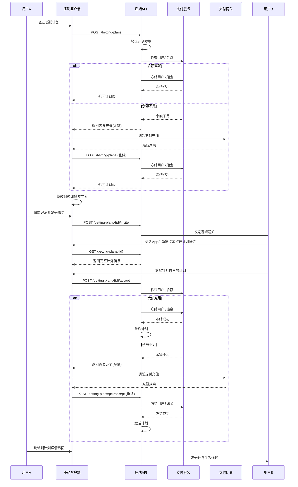
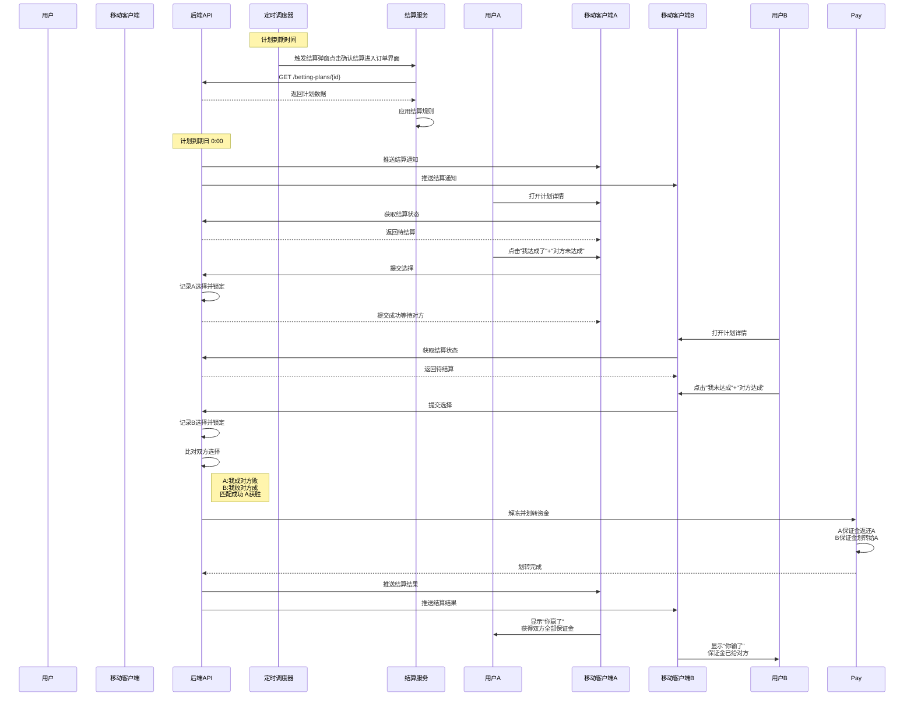
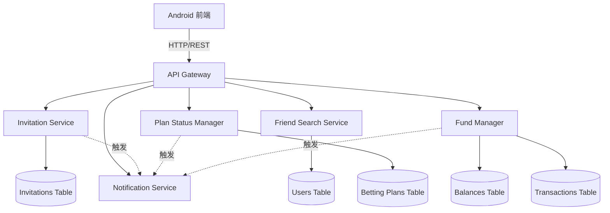
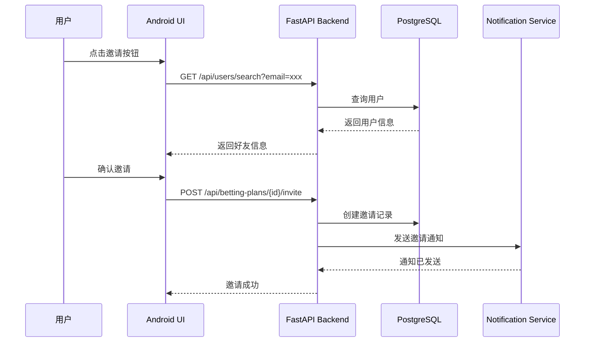

# 合并设计文档

## 概述

本文档合并了减肥对赌 APP 的所有设计，包括：
- 核心应用设计
- 好友邀请和计划放弃功能设计
- 充值后余额未更新 Bug 修复设计
- 健身推荐系统设计

---

## 第一部分：核心应用设计

### 1.1 核心价值

减肥对赌 APP 是一款基于"对赌 + 监督 + 奖励机制"的减肥应用，通过经济约束和社交监督帮助用户坚持减肥计划。

**核心机制**：
- 💰 经济激励：双方缴纳赌金，达成目标者获胜
- 👥 社交监督：好友互相对赌，相互督促
- 🏆 公平结算：透明规则，自动执行

### 1.2 技术架构

- **前端**: Android + iOS
- **后端**: FastAPI (Python) + SQLite + Redis
- **认证**: JWT Token + Firebase Auth
- **支付**: Stripe / PayPal

### 1.3 系统架构

```
┌─────────────────┐
│  移动端        │
│  (Android/iOS) │
└────────┬────────┘
         │ HTTPS
         ▼
┌─────────────────┐
│   API Gateway   │
└────────┬────────┘
         │
    ┌────┴────┬─────────┬──────────┬─────────┬──────────┐
    ▼         ▼         ▼          ▼         ▼          ▼
┌──────┐  ┌──────┐  ┌────────┐  ┌──────┐  ┌──────┐  ┌────────┐
│认证  │  │用户  │  │对赌计划│  │打卡  │  │支付  │  │结算    │
│服务  │  │服务  │  │服务    │  │服务  │  │服务  │  │服务    │
└──┬───┘  └──┬───┘  └───┬────┘  └──┬───┘  └──┬───┘  └───┬────┘
   │         │         │          │         │          │
   ▼         ▼         ▼          ▼         ▼          ▼
┌─────────────────────────────────────────────────────────┐
│                   数据存储层                              │
│  ┌──────────┐  ┌──────────┐  ┌──────────┐  ┌────────┐  │
│  │用户数据库│  │计划数据库│  │支付数据库│  │社交库  │  │
│  └──────────┘  └──────────┘  └──────────┘  └────────┘  │
│  ┌──────────┐  ┌──────────┐                             │
│  │ Redis    │  │ S3       │                             │
│  │ 缓存     │  │ 文件存储  │                             │
│  └──────────┘  └──────────┘                             │
└─────────────────────────────────────────────────────────┘
```

### 1.4 核心业务流程

#### 1.4.1 对赌计划创建与接受流程



#### 1.4.2 打卡与结算流程



### 1.5 核心组件

#### 组件 1: 认证服务 (AuthService)

**目的**: 处理用户注册、登录、身份验证和授权

**职责**:
- 处理用户注册和登录请求
- 生成和验证 JWT 令牌
- 管理用户会话
- 集成第三方认证提供商

#### 组件 2: 用户服务 (UserService)

**目的**: 管理用户个人信息和配置

**职责**:
- 管理用户个人资料
- 处理用户信息更新
- 管理支付方式绑定
- 提供用户统计数据

#### 组件 3: 对赌计划服务 (BettingPlanService)

**目的**: 管理减肥对赌计划的创建、邀请、接受和状态管理

**职责**:
- 创建和管理对赌计划
- 处理邀请和接受流程
- 验证计划参数的合理性
- 管理计划状态转换

#### 组件 4: 打卡服务 (CheckInService)

**目的**: 处理用户每日打卡和体重数据记录

**职责**:
- 记录用户每日体重数据
- 验证打卡数据的真实性
- 提供进度跟踪和可视化
- 支持对方审核机制

#### 组件 5: 支付服务 (PaymentService)

**目的**: 处理资金冻结、解冻和转账

**职责**:
- 与第三方支付网关集成
- 管理用户资金冻结和解冻
- 处理资金转账和提现
- 确保支付安全和数据加密

#### 组件 6: 结算服务 (SettlementService)

**目的**: 在计划结束时自动计算和执行结算

**职责**:
- 在计划到期时自动触发结算
- 根据规则计算双方的结算金额
- 执行资金转移
- 生成结算明细记录

#### 组件 7: 社交服务 (SocialService)

**目的**: 提供社交互动功能,包括排行榜、评论、勋章等

**职责**:
- 管理排行榜和竞争机制
- 处理用户评论和互动
- 管理勋章和成就系统
- 支持多人群组挑战

---

## 第二部分：好友邀请和计划放弃设计

### 2.1 概述

本设计文档定义了减肥对赌应用中的好友邀请和计划放弃功能的技术实现方案。该功能允许用户通过邮箱搜索并邀请好友参与减肥计划，同时支持在不同状态下放弃计划，并正确处理赌金的冻结、解冻和转账逻辑。系统采用 Python FastAPI 后端和 Kotlin Android 前端架构，确保资金操作的原子性和数据一致性。

### 2.2 架构

系统采用分层架构，包含数据层、服务层、API 层和前端展示层：



### 2.3 核心组件交互流程



### 2.4 组件和接口

#### 组件 1: Invitation Service (邀请服务)

**目的**: 管理好友邀请的创建、查询和响应

**职责**:
- 创建和存储邀请记录
- 跟踪邀请状态（pending, viewed, accepted, rejected）
- 记录邀请时间戳（发送、查看、响应）
- 防止重复邀请

#### 组件 2: Friend Search Service (好友搜索服务)

**目的**: 通过邮箱搜索用户信息

**职责**:
- 验证邮箱格式
- 查询用户数据库
- 返回用户基本信息（姓名、年龄）
- 保护用户隐私（不返回敏感信息）

#### 组件 3: Plan Status Manager (计划状态管理器)

**目的**: 管理计划状态转换和过期检查

**职责**:
- 验证状态转换的合法性
- 执行状态转换逻辑
- 定期检查过期计划
- 处理计划放弃操作

#### 组件 4: Fund Manager (资金管理器)

**目的**: 处理资金冻结、解冻和转账操作

**职责**:
- 执行原子性资金操作
- 创建交易记录
- 验证余额充足性
- 处理放弃计划的资金退还逻辑

### 2.5 计划状态

```python
class PlanStatus(str, enum.Enum):
    PENDING = "pending"      # 等待对方接受
    ACTIVE = "active"        # 进行中
    COMPLETED = "completed"  # 已完成
    CANCELLED = "cancelled"  # 已取消（放弃）
    REJECTED = "rejected"    # 已拒绝
    EXPIRED = "expired"      # 已过期
```

**状态转换规则**:
- PENDING → ACTIVE: 被邀请者接受
- PENDING → REJECTED: 被邀请者拒绝
- PENDING → CANCELLED: 创建者放弃
- PENDING → EXPIRED: 超过邀请有效期
- ACTIVE → CANCELLED: 任一方放弃
- ACTIVE → COMPLETED: 计划到期并结算
- ACTIVE → EXPIRED: 计划到期但未完成

---

## 第三部分：充值后余额未更新 Bug 修复设计

### 3.1 概述

用户在充值成功后立即创建赌注计划时，系统仍然报告余额不足。这个 bug 的核心问题是：充值接口虽然返回成功响应，但用户的账户余额并未在数据库中更新。当用户随后尝试创建需要资金的赌注计划时，系统检查余额时仍然读取到充值前的旧余额（0.0 元），导致余额不足错误。

### 3.2 Bug 分析

#### 当前行为 (缺陷)

1.1 WHEN 用户充值成功(充值接口返回 {"success":true,"message":"充值成功","amount":200.0}) THEN 系统未更新用户余额，余额仍为充值前的值(0.0元)

1.2 WHEN 用户在充值成功后立即创建赌注计划 THEN 系统仍然检查到余额不足(0.0 < 200.0)，返回402错误:"余额不足，需要充值 200.0 元"

1.3 WHEN 充值接口返回成功响应 THEN 系统未将充值金额添加到用户的可用余额中

#### 期望行为 (正确)

2.1 WHEN 用户充值成功(充值接口返回 {"success":true,"message":"充值成功","amount":200.0}) THEN 系统 SHALL 立即更新用户余额，将充值金额添加到用户的可用余额中

2.2 WHEN 用户在充值成功后立即创建赌注计划 THEN 系统 SHALL 检查到余额充足(200.0 >= 200.0)，成功创建计划并冻结相应金额

2.3 WHEN 充值接口返回成功响应 THEN 系统 SHALL 在数据库中持久化更新后的用户余额，确保后续查询能获取到最新余额

2.4 WHEN 充值操作完成 THEN 系统 SHALL 创建一条交易记录，记录充值金额和时间

### 3.3 根本原因假设

基于 bug 描述和代码分析，最可能的根本原因是：

1. **后端充值接口实现缺陷**: `/api/payments/charge` 接口在处理充值请求时，可能只是创建了充值订单记录或调用了第三方支付网关，但没有在数据库中更新用户的 `availableBalance` 字段。接口返回成功响应，但实际的余额更新逻辑缺失或未执行。

2. **数据库事务未提交**: 后端可能在事务中更新了余额，但由于某种原因（异常、事务回滚、未显式提交）导致更新未持久化到数据库。

3. **异步处理问题**: 后端可能将余额更新放在异步任务中处理，但异步任务执行失败或延迟过长，导致用户立即查询时看不到更新。

4. **缓存不一致**: 虽然数据库已更新，但客户端或服务端的缓存层未刷新，导致查询时返回旧的缓存数据。但根据代码分析，`getBalance()` 方法直接调用 API 而不使用缓存，所以这个可能性较低。

最可能的原因是 **原因 1**：后端充值接口实现缺陷，缺少余额更新逻辑。

### 3.4 修复实现

#### 需要修改的文件

**File**: `backend/api/payments.py` (或对应的后端支付服务文件)

**Function**: `charge()` 或 `POST /api/payments/charge` 的处理函数

#### 具体修改

1. **添加余额更新逻辑**: 在充值成功后（第三方支付网关返回成功或模拟充值成功后），立即查询用户当前余额，计算新余额 = 当前余额 + 充值金额，然后更新数据库中的 `users.available_balance` 字段。

2. **确保事务完整性**: 将充值记录创建和余额更新放在同一个数据库事务中，确保要么全部成功，要么全部回滚，避免数据不一致。

3. **创建交易记录**: 在更新余额的同时，创建一条类型为 `charge` 的交易记录，记录充值金额、时间和状态，便于审计和对账。

4. **返回更新后的余额**: 在充值接口的成功响应中，除了返回 `success=true` 和 `transactionId`，还应返回更新后的 `newBalance`，让客户端可以立即更新本地显示。

5. **添加日志记录**: 在余额更新前后记录日志，包括用户 ID、充值金额、更新前余额、更新后余额，便于排查问题。

#### 伪代码示例

```python
def charge(user_id, amount, payment_method_id):
    # 验证参数
    if amount <= 0:
        return {"success": False, "message": "充值金额必须大于0"}
    
    # 开始数据库事务
    with database.transaction():
        # 1. 调用第三方支付网关(或模拟充值)
        payment_result = payment_gateway.process_charge(amount, payment_method_id)
        
        if not payment_result.success:
            return {"success": False, "message": "支付处理失败"}
        
        # 2. 查询用户当前余额
        user = database.query("SELECT * FROM users WHERE id = ?", user_id)
        old_balance = user.available_balance
        
        # 3. 计算新余额
        new_balance = old_balance + amount
        
        # 4. 更新用户余额 (关键修复点)
        database.execute(
            "UPDATE users SET available_balance = ? WHERE id = ?",
            new_balance, user_id
        )
        
        # 5. 创建交易记录
        transaction_id = generate_uuid()
        database.execute(
            "INSERT INTO transactions (id, user_id, type, amount, status, created_at) VALUES (?, ?, 'charge', ?, 'completed', NOW())",
            transaction_id, user_id, amount
        )
        
        # 6. 记录日志
        log.info(f"User {user_id} charged {amount}, balance updated from {old_balance} to {new_balance}")
        
        # 7. 提交事务
        database.commit()
    
    # 8. 返回成功响应,包含新余额
    return {
        "success": True,
        "transactionId": transaction_id,
        "message": "充值成功",
        "amount": amount,
        "newBalance": new_balance
    }
```

---

## 第四部分：减肥推荐系统设计

### 4.1 产品概述

#### 产品定位
- **非对话型**：不做开放式聊天，只做结构化推荐
- **输入驱动**：用户输入体重数据 → 系统输出今日推荐
- **本地优先**：模型本地部署，数据后端管理

#### 核心场景

| 场景 | 用户行为 | 系统响应 |
|------|---------|---------|
| 健康教练初始化 | 用户登录时| 结合用户体重数据，返回今日训练+饮食建议 |
| 健康教练 | 用户打卡| 结合用户体重数据，返回今日训练+饮食建议 |

### 4.2 功能模块

#### 模块 A：用户数据管理（后端）

**职责**：存储、查询、计算用户数据

| 功能 | 说明 |
|------|------|
| 用户档案 | 身高、初始体重、目标体重 |
| 打卡记录 | 运动类型、时长、日期、结合用户身高数据算出最新的 BMI |
| 趋势计算 | 周环比、月环比、平台期检测 |

**调用方式**：采取登录初始化、打卡时更新用户数据的调用方式，确保用户不用等待模型返回推荐结果，所以返回的数据需要临时存储

### 4.3 安卓端实现

#### 推荐缓存管理器

创建 `RecommendationCacheManager` 类，负责：
- 缓存推荐数据到 SharedPreferences
- 提供获取缓存推荐的方法
- 提供清空缓存的方法

#### 推荐仓库修改

修改 `RecommendationRepository` 类：
- 集成推荐缓存管理器
- `getRecommendation()` 方法优先从缓存读取
- 添加 `cacheRecommendation()` 方法用于缓存推荐结果
- 添加 `getCachedRecommendation()` 方法用于获取缓存

#### 管家页面修改

修改 `CoachViewModel` 和 `CoachFragment`：
- 只读取缓存数据，不直接调用 API
- 添加空状态处理
- 显示"请先登录或打卡后获取推荐"提示

#### 登录和打卡修改

修改 `LoginViewModel` 和 `CheckInViewModel`：
- 登录成功后，异步调用推荐 API 并缓存结果
- 打卡成功后，异步调用刷新推荐 API 并更新缓存
- 推荐获取失败不影响登录或打卡的成功状态

---

## 术语表

### 核心应用术语

- **System**: 减肥对赌 APP 系统(包括移动客户端和后端服务)
- **User**: 已注册并登录的应用用户
- **Creator**: 创建对赌计划的用户
- **Participant**: 接受并参与对赌计划的用户
- **BettingPlan**: 对赌计划,包含双方的减肥目标和赌金信息
- **CheckIn**: 用户每日打卡记录,包含体重数据
- **Settlement**: 计划到期后的结算记录
- **FrozenFunds**: 冻结资金,用户参与计划时冻结的赌金
- **Platform**: 应用平台(Android 或 iOS)

### 邀请和计划放弃术语

- **User**: 使用减肥对赌应用的用户
- **Plan_Creator**: 创建减肥计划的用户
- **Plan_Participant**: 被邀请参与减肥计划的用户
- **Betting_Plan**: 减肥对赌计划，包含目标、时间范围和赌金信息
- **Invitation_System**: 处理好友邀请的系统组件
- **Friend_Search_Service**: 根据邮箱搜索好友信息的服务
- **Plan_Status_Manager**: 管理计划状态转换的系统组件
- **Fund_Manager**: 处理赌金冻结、退还和分配的系统组件
- **Notification_Service**: 发送通知给用户的服务
- **Stake_Amount**: 用户为参与计划而冻结的赌金金额

### Bugfix 术语

- **Bug_Condition (C)**: 充值成功但余额未更新的条件 - 当充值接口返回成功响应但数据库中的用户余额未增加充值金额
- **Property (P)**: 充值成功后的期望行为 - 用户的可用余额应立即增加充值金额,并在数据库中持久化
- **Preservation**: 其他余额操作(冻结、解冻、转账、提现)和余额查询功能必须保持不变
- **charge()**: PaymentRepository 中的充值方法,调用后端 API `/api/payments/charge`
- **getBalance()**: UserRepository 中的获取余额方法,调用后端 API `/api/users/{userId}/balance`
- **availableBalance**: 用户可用余额,可以用于创建赌注计划或提现
- **frozenBalance**: 用户冻结余额,参与活跃计划时被冻结的资金
- **CacheManager**: 本地缓存管理器,缓存用户信息以减少网络请求
